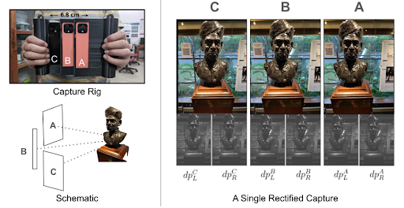
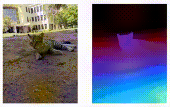

The dataset has been opensourced here. 
<!-- TODO
insert link for dataset
-->
It consists of 3 views, each containing 5 channels of data (R, G, B, dual pixel right and dual pixel left)
{:style="display:block; margin-left:auto; margin-right:auto"}

In effect it is a dataset with 3 synchronized videos per capture with a slight difference in viewpoint.

{:style="display:block; margin-left:auto; margin-right:auto"}
*note that stippling effects are introduced by lossy compression and can be ignored*

[Back to homepage](./index.markdown)
