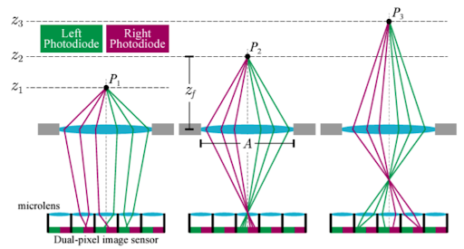
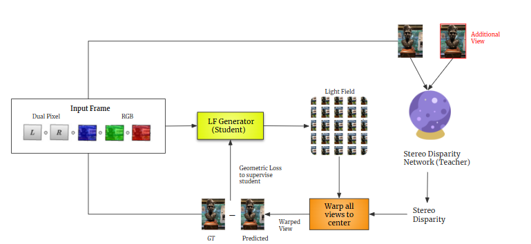
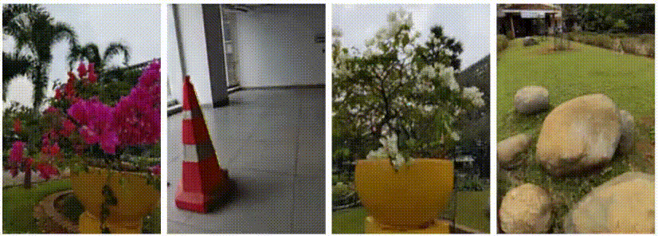
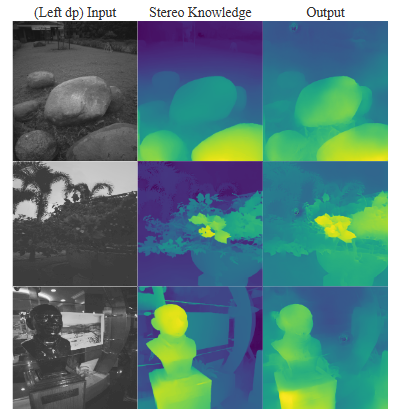

---
# Feel free to add content and custom Front Matter to this file.
# To modify the layout, see https://jekyllrb.com/docs/themes/#overriding-theme-defaults

layout: default
---

Dual pixels contain disparity cues arising from the defocus blur. This disparity information is useful for many vision tasks ranging from autonomous driving to 3D creative realism. However, directly estimating disparity from dual pixels is less accurate.

{:style="display:block; margin-left:auto; margin-right:auto"}

This work hypothesizes that distilling high-precision dark stereo knowledge, implicitly or explicitly, to efficient dual-pixel student networks
enables faithful reconstructions. This dark knowledge distillation should also alleviate stereo-synchronization setup and calibration costs while dramatically increasing parameter and inference time efficiency.

We collect the first and largest 3-view dual-pixel video dataset, dpMV, to validate our explicit dark knowledge distillation hypothesis. We show that these methods outperform purely monocular solutions, especially in challenging foreground-background separation regions using faithful guidance from dual pixels.

{:style="display:block; margin-left:auto; margin-right:auto"}

Finally, we demonstrate an unconventional use case unlocked by dpMV and implicit dark knowledge distillation from an ensemble of teachers for Light Field (LF) video reconstruction.

{:style="display:block; margin-left:auto; margin-right:auto"}
*note that stippling effects are introduced by lossy compression and can be ignored*

Our LF video reconstruction method is the fastest and most temporally consistent to
date. It remains competitive in reconstruction fidelity while offering many other essential properties like high parameter efficiency, implicit disocclusion handling, zero-shot cross-dataset transfer, geometrically consistent inference on higher spatial-angular resolutions, and adaptive baseline control.

{:style="display:block; margin-left:auto; margin-right:auto"}

The novel contributions of our paper are as follows:
1. We propose an algorithm for the distillation of dark knowledge from the stereo dataset as a supervisor. This enables our network to implicitly extract depth information from the dual pixel data and utilize it to create better reconstructions.
2. We open source our dataset of dual pixel videos with 3 views, the first of its kind.
3. We use vision transformers for the first time in the light field reconstruction domain, enabling zero-shot cross domain knowledge transfer.

This work was done in the [Computational Imaging Lab, IIT Madras](https://www.ee.iitm.ac.in/comp_photolab/) under the guidance of [Dr. Kaushik Mitra, kmitra [at] ee [dot] iitm [dot] ac [dot] in](mailto:kmitra@ee.iitm.ac.in)

For questions related to the algorithm and results, please contact the primary author [Aryan Garg, aryangarg019@gmail.com](mailto:aryangarg019@gmail.com). For any other questions, please contact the other authors of the paper: [Raghav Mallampalli, raghavmallampalli1234@gmail.com](mailto:raghavmallampalli1234@gmail.com), [Akshat Joshi, aryangarg019@gmail.com](mailto:aryangarg019@gmail.com), [Shrisudhan Govindarajan, shrisudhan07@gmail.com](mailto:shrisudhan07@gmail.com)